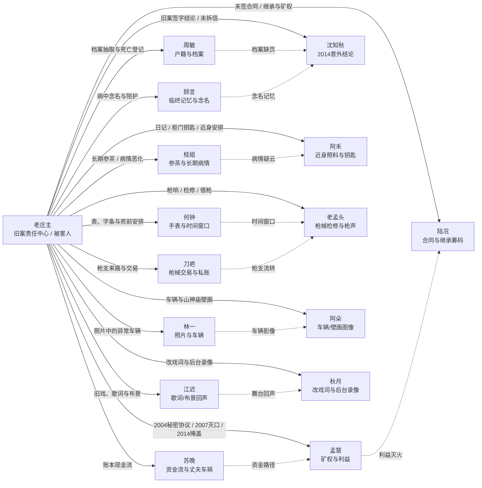

# M16 · 16 人物关系图 v1

> 基于 `docs/逻辑修正表_v1.md` 与 `cases/v2_16人物故事线.md` 整理。
> 本图是案件契约前的结构草图：用于检查连接是否闭合，不等于最终凶手揭晓。

## 一、关系网总览



## 二、三层关系说明

### 1. 旧案责任层

这一层回答“谁对 2004–2023 的旧案负有责任”，不直接回答“谁在 2024 年开枪”。

- **老庄主**：协议执行、学生失踪、禁令与后续掩盖的责任中心。
- **孟慧**：矿权和资金利益的主要受益方。
- **苏晚**：资金链的受益者与追查者，因丈夫车祸重新回到旧账。
- **沈知秋**：2014 年“意外”结论的制度性签字者。
- **周敏**：掌握死亡登记、户籍和档案缺页。
- **陆况**：掌握合同、继承和矿权相关的后续筹码。

### 2. 当晚机会层

这一层回答“谁可能接触到庄主、枪、车辆或时间窗口”。

- **阿禾**：近身照料、柜门钥匙、庄主私人安排。
- **桂姐**：长期参茶与病情背景，但参茶不能替代枪击死因。
- **刀疤**：老枪来路、交易记录和可能的冲动行动。
- **老孟头**：枪械检修与枪响判断，属于物证权威而非默认嫌疑人。
- **阿朵**：看到车辆或现场局部图像。
- **何钟**：提供表与字条，限定时间窗口。

### 3. 真相传递层

这一层回答“谁把局部事实带到读者面前”。

- **林一**：照片提供视觉证据，但不保证理解证据。
- **顾言**：提供庄主病中念名和伦理判断，不替读者定罪。
- **江迟**：通过歌词、布景或舞台提供旧案的情绪回声。
- **秋月**：通过改戏词和后台录像释放庄主留下的信息。
- **周敏、何钟、老孟头**：分别从档案、时间、枪械角度提供可验证物证。

## 三、核心证据链

### A. 资金—利益链

```text
2004秘密协议
  → 猎庄账上现金流
  → 苏晚第一桶金
  → 苏晚丈夫车祸关联维修厂流水
  → 苏晚回猎庄追查数字
  → 孟慧与陆况的利益筹码
```

**叙事用途**：支持 B 型“冷算布局”解释。  
**必须避免**：资金链成立，不代表苏晚或孟慧自动是当晚凶手。

### B. 档案—沉默链

```text
2007学生失踪
  → 2014尸体被转移并伪装溺亡
  → 沈知秋签下意外结论
  → 学生母亲来信
  → 沈知秋未拆信
  → 周敏发现档案缺页与未完成死亡登记
```

**叙事用途**：支持 A 型“情绪背叛/责任沉默”解释。  
**必须避免**：制度性沉默不能直接等同于枪击行为。

### C. 枪械—时间链

```text
庄主死前托付表与字条
  → 何钟保管并提供时间窗口
  → 老孟头提供检修与枪声判断
  → 刀疤提供枪支来路或交易记录
  → 阿朵/林一提供车辆与现场图像
  → 锁定当晚谁有机会移动、接触或掩盖
```

**叙事用途**：支持 C 型“冲动误杀后掩盖”解释。  
**必须避免**：枪械证据不能只由刀疤一人提供，否则会把证据链压成单点。

### D. 身体—信任链

```text
桂姐长期参茶
  → 庄主慢性肝病恶化
  → 阿禾近身照料与日记
  → 顾言记得病中念名
  → 庄主在最后召集前已处于脆弱状态
```

**叙事用途**：制造“庄主是否本就会死、枪击是否是最后一击”的疑云。  
**必须避免**：把参茶写成无需验证的毒杀结论。

### E. 舞台—记忆链

```text
2007旧案
  → 猎庄旧戏《三更雨》
  → 江迟的歌词/布景回声
  → 秋月父亲留下的戏词
  → 老庄主改过的戏词
  → 后台录像中的不该出现的人
```

**叙事用途**：让真相以文化记忆和戏剧时机被听见，而不是由角色直接讲解设定。

## 四、关系图的嫌疑分层

| 层级 | 角色 | 叙事任务 |
|---|---|---|
| B 型主入口 | 苏晚 | 以账目、资金流和复仇疑云推动冷算布局线 |
| A 型主入口 | 阿禾 | 以忠诚、信任与隐瞒推动情感背叛线 |
| C 型主入口 | 刀疤 | 以枪械、交易和冲动行动推动误杀掩盖线 |
| 主要候选 | 孟慧、陆况、沈知秋、桂姐 | 提供足够动机，但不同时拥有完整机会与证据 |
| 证人/引线 | 顾言、江迟、林一、何钟、周敏、老孟头、阿朵、秋月 | 各自提供一段局部事实或一类证据 |
| 被害人/动机中心 | 老庄主 | 连接旧案、召集、遗留物证与当晚死亡 |

## 五、当前关系网的三个缺口

1. **老庄主的召集动机未定**：悔悟公开、死前清算，还是两者兼有。
2. **枪支实际流转未闭合**：目前可以确认“谁懂枪”，还不能确认“谁在何时接触过枪”。
3. **四个待补指称仍是占位**：山神庙壁画姓名、陈建国遗书姓名、周敏走访记录中的人、刀疤卖枪的另一方。

在这三个缺口补齐前，本关系图适合作为结构审校图，不适合作为最终剧情时间线。
